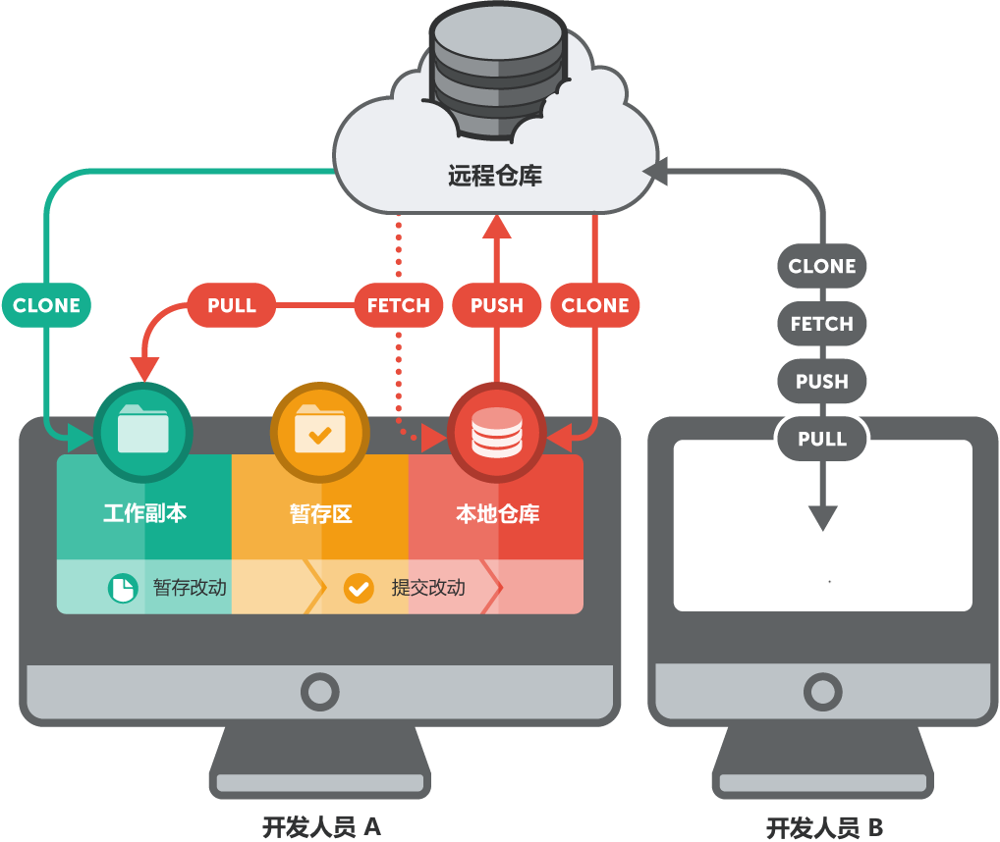

## 设置 Git

用户名，邮箱地址设置

```zsh
$ git config --global user.name "John Doe"
$ git config --global user.email "john@doe.org"
```

## 工作流程

### 仓库（Repository）

存储了项目积攒的所有版本和元数据（metadata）的数据库。在 Git 中，仓库是一个在项目的根目录下名为 “.git” 的隐藏文件夹。

获取一个本地仓库到计算机上：

- 如果在本地计算机中已经存在了一个项目，但是尚未纳入版本控制系统中，你可以为这个项目初始化一个新的仓库。

  ```zsh
  // “git init” 命令建立一个 Git 项目
  $ git init
  ```

- 如果你需要得到一个已经纳入版本控制系统中的项目，而且它已经存放在一个远程服务器中 （比如在互联网或者是你的局域网中）。你只需要知道这个仓库的 URL 地址，然后克隆 （下载/拷贝） 到你的本地计算机中就可以了。这个 URL 可能采用如下形式：

  - `ssh://user@server/git-repo.git`
  - `user@server:git-repo.git`
  - `http://example.com/git-repo.git`
  - `https://example.com/git-repo.git`
  - `git://example.com/git-repo.git`

  ```zsh
  $ git clone https://github.com/gittower/git-crash-course.git
  ```

  - 对于　“http” and “git” 协议，你不需要任何权限。
  - 对于　“https” URLs，你可能需要输入用户名以及密码。
  - 对于　“ssh” URLs （无论是以 “ssh://” 开头的或者是一个简易格式，“user@server...”），你必须要通过一个 “SSH 公钥（SSH Public Key）” 的认证。

**本地和远程仓库（Local & Remote Repositories)**

- "本地" 仓库（local repository） 是放置在你的本地计算机中的，它以一个隐藏文件夹的形式存储在项目的根目录（root folder） 中。你是唯一个有权通过提交改动来操作这个仓库的用户。
- "远程" 仓库（remote" repository）则相反，它通常是位于一个远程服务器上的，比如在互联网上或在你的局域网络上。没有任何工作文件与远程仓库相关联：它没有工作目录（working directory），而是完全由 “.git”仓库目录组成的。开发团队使用远程仓库进行数据共享和交换，远程仓库是协作开发时的一个共同基础，每个项目成员都可以发布自己的改动，同样也都可以接收到其他成员的改动。

### .gitignore 的用法

#### Git 忽略规则优先级

在 .gitingore 文件中，每一行指定一个忽略规则，Git 检查忽略规则的时候有多个来源，它的优先级如下（由高到低）：

1. 从命令行中读取可用的忽略规则
2. 当前目录定义的规则
3. 父级目录定义的规则，依次递推
4. $GIT_DIR/info/exclude 文件中定义的规则
5. core.excludesfile 中定义的全局规则

#### Git 忽略规则匹配语法

在 .gitignore 文件中，每一行的忽略规则的语法如下：

```zsh
* 空格不匹配任意文件，可作为分隔符，可用反斜杠转义
* 开头的文件标识注释，可以使用反斜杠进行转义
* ! 开头的模式标识否定，该文件将会再次被包含，如果排除了该文件的父级目录，则使用 ! 也不会再次被包含。可以使用反斜杠进行转义
* / 结束的模式只匹配文件夹以及在该文件夹路径下的内容，但是不匹配该文件
* / 开始的模式匹配项目跟目录
* 如果一个模式不包含斜杠，则它匹配相对于当前 .gitignore 文件路径的内容，如果该模式不在 .gitignore 文件中，则相对于项目根目录
* ** 匹配多级目录，可在开始，中间，结束
* ? 通用匹配单个字符
* * 通用匹配零个或多个字符
* [] 通用匹配单个字符列表
```

**常用匹配示例**

```zsh
bin/: 忽略当前路径下的bin文件夹，该文件夹下的所有内容都会被忽略，不忽略 bin 文件
/bin: 忽略根目录下的bin文件
/*.c: 忽略 cat.c，不忽略 build/cat.c
debug/*.obj: 忽略 debug/io.obj，不忽略 debug/common/io.obj 和 tools/debug/io.obj
**/foo: 忽略/foo, a/foo, a/b/foo等
a/**/b: 忽略a/b, a/x/b, a/x/y/b等
!/bin/run.sh: 不忽略 bin 目录下的 run.sh 文件
*.log: 忽略所有 .log 文件
config.php: 忽略当前路径的 config.php 文件
```

- **忽略一个特定的文件**：给出从项目根目录开始的路径和文件名，例如：path/to/file.ext 。
- **忽略项目下所有这个名字的文件**：只要给出文件的全名，不要包括任何路径，例如 filename.ext 。
- **忽略项目下所有这个类型的文件**：例如 *.ext 。
- **忽略一个特定目录下的所用文件**：例如　path/to/folder/* 。

#### .gitignore 规则不生效

.gitignore 只能忽略那些原来没有被 track 的文件，如果某些文件已经被纳入了版本管理中，则修改 .gitignore 是无效的。

解决方法就是先把本地缓存删除（改变成未 track 状态），然后再提交:

```zsh
$ git rm -r --cached .
$ git add .
$ git commit -m 'update .gitignore'
```

**你想添加一个文件到 Git，但发现添加不了，原因是这个文件被 .gitignore 忽略了：**

```zsh
$ git add App.class
The following paths are ignored by one of your .gitignore files:
App.class
Use -f if you really want to add them.
```

如果你确实想添加该文件，可以用 -f 强制添加到 Git ：

```zsh
$ git add -f App.class
```

或者你发现，可能是 .gitignore 写得有问题，需要找出来到底哪个规则写错了，可以用 git check-ignore 命令检查：

```zsh
$ git check-ignore -v App.class
.gitignore:3:*.class    App.class
```

Git 会告诉我们，.gitignore 的第3行规则忽略了该文件，于是我们就可以知道应该修订哪个规则。

### 提交（Commit）

一次提交包含了一组特定的变化。版本控制系统会为每次提交创建一个单独的版本。这就是项目在这个特定时间点的快照（snapshot）。

```zsh
// 添加改动文件到暂存区（Staging Area）
$ git add .
// 为本次提交添加注释
$ git commit -m "message"
// commit 这一步完成后，本地仓库会被更新，然后会为这个项目建立一个新的版本
// 推送到远程仓库
$ git push
```

#### 暂存区（Staging Area）

提交改动到暂存区（Staging Area），使用 “git add” 命令：

```zsh
$ git add files
```


如果我们想把文件 “error.html” 从版本控制中移除掉，我们必须使用 “git rm” 来完成它：

```zsh
$ git rm error.html
```

#### 查看改动详情 git status

其中包括了三个主类别：

- “Changes not staged for commit” 改动的文件，但没有打包在下次提交中。
- “Changes to be committed” 改动的文件，并且已打包在下次提交中。
- “Untracked files” 未被追踪的文件。

```zsh
$ git status
# On branch master
# Changes not staged for commit:
#   (use "git add/rm <file>... " to update what will be committed)
#   (use "git checkout -- <file>..." to discard changes in working
#    directory)
#
#       modified:   css/about.css
#       modified:   css/general.css
#       deleted:    error.html
#       modified:   imprint.html
#       modified:   index.html
#
# Untracked files:
#    (use "git add <file>..." to include in what will be committed)
#       new-page.html
no changes added to commit (use "git add" and/or "git commit -a")
```

#### 提交你的改动 git commit

“git commit” 命令将提交你的修改：

```zsh
$ git commit -m "Implement the new login box"
```

显示在项目中所有的提交历史记录可以使用 “git log” 命令：

```zsh
$ git log
```

在 “git log” 命令后使用 “-p” 参数来显示一些更多的提交记录详情。

## 分支

### 创建分支 git branch

我们建立一个新的分支，并且命名为 “contact-form”：

```zsh
$ git branch contact-form
```

使用 “git branch” 命令来显示出所有在项目中已经存在的分支，而且可以使用参数 “-v” 来显示出很多的信息：

```zsh
$ git branch -v
  contact-form 3de33cc Implement the new login box
* master       3de33cc [ahead 1] Implement the new login box
```

你可以看到那个我们新建立的分支 “contact-form”，而且它是基于相同版本的 “master” 分支。除此之外，**那个星号（*）旁边的 “master” 代表了这个分支是我们当前的 HEAD 分支**。

### 暂存更改 git stash

一个被提交了的改动会被永久地保存在仓库（repository）中。比如你必须要开始一个新的工作，而在你的当前工作版本中还有一些并不想立即提交的本地改动。在处理好这些本地改动的同时，我们还需要把当前的工作副本（working copy）清理出来，Git 提供的 “储藏（Stash）” 功能可以非常好地解决这个问题。

#### 储藏（Stash）

可以把储藏想象成一种剪贴板，它会获取你工作副本（working copy）中的所有改动，并且保存到一个新的剪贴板上。然后你就会得到一个“干净”的工作副本，也就是说一个不存在任何改动的工作目录。

之后你随时都可以重新调回那些保存在剪贴板中的改动到你的工作副本中来，从而继续你之前没有完成的工作。

你可以建立多个储藏单元，不仅仅局限于存储一组变化。同样，**储藏也会不绑定在你所处的当前分支或是任何其它分支上，如果你想要调回任意一个储藏单元，它的改动将会被应用在你当前的 HEAD 分支上**。

```zsh
$ git stash
Saved working directory and index state WIP on master: 
   2dfe283 Implement the new login box
HEAD is now at 2dfe283 Implement the new login box

$ git stash list
stash@{0}: WIP on master: 2d6e283 Implement the new login box
```

当你想要调回一个之前建立的储藏单元，有两种方法：

- 使用 “git stash pop” 命令，它将调回最新的一个储藏单元，并且把它从剪贴板中删除掉。
- 使用 “git stash apply <stashname>” 命令，它将调回那个你所给出的储藏单元，而这个储藏单元还会保留在剪贴板中。你可以随时使用 “git stash drop <stashname>” 来删除它。

当你使用这些命令时，你不必给出特定的储藏单元名称。 Git 将会自动地处理最新的那个储藏单元（永远是 “stash@{0}”）。

#### 储藏的时机

储藏功能可以帮助我们得到一个干净的工作副本。当然，它还可以应用在很多不同的流程中，强烈推荐你在下列情况中储藏你的本地改动：

- ……在切换到不同分支之前。
- ……在获取（pulling）远程改动之前。
- ……在合并（merging）或者衍合（rebasing）一个分支之前。

### 切换分支 git checkout

```zsh
$ git checkout contact-form
```

#### 签出（Checkout)，HEAD，和你的工作副本（Working Copy)

分支会自动指向最后一次的提交。而且，一个提交也对应项目中的一个特定版本，Git 总是非常地清楚定位哪些文件属于该分行。


在这个时间点，仅仅有**一个**分支被指向 HEAD，或者说仅仅有**一个**被签出（checked out）的活动分支。在你的工作副本上的文件都会被关联在这个分支上。所有其它的分支以及它们的关联文件都被安全地保存在 Git 的数据库中了。

指定另外一个分支为活动分支（比如我们之前建立的 “contact-form” ），可以使用 “git checkout” 命令。 这个命令会为我们完成两件事：

- 它会让 HEAD 指针指向这个 “contact-form” 分支。
- 它会替换你工作目录（working directory）中的所有文件，并且完全匹配它们的版本到 “contact-form”。

### 合并改动 git merge

它只需要两个步骤：

- 切换到那个需要接收改动的分支上。
- 执行 “git merge” 命令，并且在后面加上那个将要合并进来的分支的名称。

```zsh
$ git checkout master
$ git merge contact-form
```

 Git 并不是简单地将那些需要的提交整合到你的 HEAD 分支中去，它经常会结合出一个新的改动，然后执行 “merge commit” 进行一次单独的提交。你可以把这种提交想象成连接两个分支的节点。


### 分支的使用策略

#### (A) 短期分支（Short-Lived）/主题分支（Topic Branches）

建立分支的一些建议，例如：*对应新功能的分支*，*修复错误的分支* 以及 *进行代码尝试所建立的分支*。这些分支都有两个重要共同特征：

- 它们只涉及一个**单一主题**，而且它包含的代码要和它的主题相对应。例如，你不应该建立一个关于购物车功能的分支，并且再在这个分支上去提交一些有关于邮件订阅功能和错误修复的改动。
- 它们都只有非常短暂的生命周期。通常情况下，这个生命周期只维持到这个开发主题的结束之后（例如当错误被修复，新功能被完成……），这个分支的改动就会被整合到项目的大环境中去，并且这个分支也会被随之删除掉。


#### (B) 长期分支 Long-Running Branches

相对于那些基于一个单一开发主题或是一个错误修复的短期分支来说，这类分支被定义在更高的层面上。它们代表了在整个项目生命周期的一种状态（比如：“产品”，“测试”，“研发”状态）。它们在项目中保存的时间比较长，甚至可能是整个项目的生命周期。这类分支有如下一些典型特点：

- 你不应该直接在这个分支上工作。但是你可以整合其他的分支（例如功能分支或是其他的长期分支）到这类分支中来，尽量不要对它直接进行提交。
- 一般来说，在长期分支之间也存在不同的等级。例如 “master” 分支一般被定义为最高等级。它应该只保存产品代码（production code）。在它之下应该存在一个 “开发（development）” 分支。它会被用来进行真正的开发和测试工作，然后整合入 “master” 分支……

## 远程仓库

### 本地仓库与远程仓库的区别

- **位置**。本地仓库位于每一个团队成员的本地计算机上。相反，远程仓库则被设置在一个能被所有团队成员访问到的远程服务器上，基本上都是在**互联网上或者是本地局域网中**。
- **特点**。从技术上讲，一个远程仓库和一个本地仓库并不存在很大差异。和本地仓库一样，它包含分支，提交和标记。然而，**本地存储库存在一个与之相关的工作副本（working copy），就是你当前的工作目录**。其中包括了你从项目中签出的一些版本文件。而一个**远程仓库就不包含任何工作目录，它仅仅是由一系列 “.git” 目录组成的**。
- **创建**。你有两种方法来创建一个本地仓库到你的本地计算机上，你可以新建一个空的仓库，或者是克隆一个已存在的远程仓库到你的本地计算机中。创建一个新的远程仓库同样的也有两种方法。方法一，假如已经存在了一个本地仓库，并且你想以这个本地仓库作为远程仓库的基准，你使用 “--bare” 参数来可以克隆这个本地仓库。方法二，假如你想要新建一个空的远程仓库，你可以使用 “git init” 命令，并且同时也要加上 “--bare” 参数。

### 本地 / 远程工作流程



### 连接一个远程仓库

“origin” 来标识你所克隆的原始仓库。
如果你是直接在计算机上创建了一个本地仓库，这样就没有任何一个远程链接被记录下来。这种情况下，当你尝试做任何远程操作之前你就必须先把它连接到一个远程仓库上去：

```zsh
$ git remote add crash-course-remote
    https://github.com/gittower/git-crash-course-remote.git
```

来让我们来看看它的结果：

```zsh
$ git remote -v
crash-course-remote   https://github.com/gittower/git-crash-course-remote.git (fetch)
crash-course-remote   https://github.com/gittower/git-crash-course-remote.git (push)
origin   https://github.com/gittower/git-crash-course (fetch)
origin   https://github.com/gittower/git-crash-course (push)
```

请注意，每个远程仓库包含两行，第一个是用来进行抓取的 “fetch URL”，第二个是用来把本地仓库中的数据推送到远程仓库 “push URL”。很多情况下这两个 URLs 都是相同的。然而你当然也可以对抓取（fetch）和推送（push）使用两个不同的 URLs（例如出于安全和性能方面的考虑）。

此外还要注意到，你**可以对一个本地仓库设置很多个远程链接**，这是没有数量限制的。在上面的例子中你已经看到了一个已经存在的链接 “origin” ，其实我们从来也没有设置过它！在完成某个远程仓库的克隆之后，Git 会默认的建立一个名为 “origin” 的远程仓库链接。和被命名为 “master” 的分支一样的道理，“origin” 这个名字是默认的。它和其他的远程仓库并没有什么区别。

### 查看远程数据 git fetch

要更新有关远程的信息，你必须明确地请求这个数据。在这里可以使用最为常用的，“抓取（Fetch）” 操作来完成：

```zsh
$ git fetch crash-course-remote
From https://github.com/gittower/git-crash-course-remote
 * [new branch]     faq-content -> crash-course-remote/faq-content
 * [new branch]     master -> crash-course-remote/master
```

“抓取” 操作不会改动你任何的本地分支或是在你工作副本中的文件。这个操作仅仅为你从一个特定远程仓库下载你所需要的数据，并设置为可见。

执行 “git checkout” 命令来切换到这个远程分支：

```zsh
$ git checkout --track crash-course-remote/faq-content
Branch faq-content set up to track remote branch faq-content from crash-course-remote.
Switched to a new branch 'faq-content'

$ git branch -va
  contact-form           56eddd1 Add new contact form page
* faq-content            e29fb3f Add FAQ questions
  master                 56eddd1 Add new contact form page
  remotes/crash-course-remote/faq-content  e29fb3f Add FAQ questions
  remotes/crash-course-remote/master       2b504be Change headlines f...
  remotes/origin/HEAD    -> origin/master
  remotes/origin/master  2b504be Change headlines for about and imprint
```

这个命令完成了一系列的操作：

- 它创建了一个同名的本地分支（“faq-content”）。
- 它签出（check out）了这个新建的的分支，把它设置成当前的本地 HEAD ，然后更新了你的工作副本，并且关联到分支文件的最新版本上去。
- 由于我们使用了 “--track” 参数，它会在新的本地分支和它所位于的远程分支之间创建一个跟踪联系 “tracking relationship”。

如果分支间存在 “跟踪” 联系，当你使用 “git status” 命令时，Git 显示出所有关联分支上的差异：

```zsh
$ git status
# On branch dev
# Your branch and 'origin/dev' have diverged,
# and have 1 and 2 different commits each, respectively.
#
nothing to commit (working directory clean)
```

当在一个已存在的远程分支的基础上来建立本地分支时，创建这个 “跟踪” 联系是很简单的，可以使用 “git checkout” 命令加 “--track” 参数来完成。

### 整合远程的改动

检查一下改动：

```zsh
$ git fetch origin
$ git log origin/master
```

整合这些改动到你的本地副本中来， 可以使用 “git pull” 命名来完成这个操作：

```zsh
$ git pull
```

这个命令将会从远程分支下载所有的新的提交到你的本地副本中来。它实际上就是一个 “抓取（fetch）” 命令（下载数据） 和 一个 “ 合并（merge）” 命令（整合那些下载的数据到你的本地副本）的组合。

### 删除分支

假设我们在 “contact-form” 分支上的工作已经完成了。并且我们也已经把最终的改动整合到了 “master” 分支。现在我们就不再需要这个分支了。把它删除掉吧：

```zsh
$ git branch -d contact-form
```

为了保持一致，我们也有必要删除它所对应的远程分支。附加上一个 “-r” 参数就可以了：

```zsh
$ git branch -dr origin/contact-form
```

## 撤销操作

### 修改最后一次提交 git commit --amend

当你认为提交有问题时，你都可以使用 “git commit” 命令，并附带上 “--amend” 参数，这个操作可以非常轻松地来修改你的**最后一次**提交。

如果你仅仅是想修改上一次的提交注释，你并不需要操作暂存区，简单地再次输入 “git commit --amend” 并附带上正确的注释就可以了：

```zsh
$ git commit --amend -m "This is the correct message"
```

如果你想要添加更多的改动到上一次提交中，你可以像平常一样把这些新的改动添加到暂存区。然后再次使用 “--amend” 参数进行提交：

```zsh
$ git add some/changed/file.ext
$ git commit --amend -m "commit message"
```

### 撤销本地改动 git checkout --

当改动还没有被提交之前，它们仍然被称之为 “本地” 改动。这些在你的工作目录（working directory）的修改还仍然在本地，它们属于未被提交的改动（uncommitted changes）。
有时候你对代码进行了一些修改，但是发现这些改动带来的问题比之前还要多。在这种情况下，你可能想要放弃你刚刚的改动，让代码恢复到你改动之前的版本，也就是上次提交之后的状态。

恢复一个文件到上次提交之后的状态，你可以使用 “git checkout” 命令：

```zsh
$ git checkout -- file/to/restore.ext
```

我们已经知道了 “checkout” 命令主要是用来切换分支用的。但是你同样可以给这个命令附带上 “--” 参数，并加上用一个空格来分隔的文件路径。**这个操作将撤销在特定文件上所有的未提交的改动。**

如果你想要放弃你在工作副本（working copy）中的所有本地改动，并让你的本地副本恢复到上次提交之后的版本，你可以使用 “git reset” 命令：

```zsh
$ git reset --hard HEAD
```

上面这个操作会通知 Git 将你本地副本上的所有文件替换到和 “HEAD” 分支一致的版本(也就是上次提交之后的版本状态)上，并放弃所有的本地改动。

### 撤销已提交的改动 git revert

使用 “git revert” 命令可以撤销某个之前的提交。但是这个命令并不是删除那个提交，相反的，它是恢复那个提交的改动，这只是看起来像是撤销而已。这个操作实际上会自动产生一个新的提交。在提交中包括了你想要撤销的那个提交的所有反向改动。例如在原始提交中，你在某一个位置添加一些字符，那么这个恢复提交（reverting commit）就会把这些字符删除掉。


如果想要撤销已提交的改动，你只需要简单地给出这个提交的 commit hash：

```zsh
$ git revert 2b504be
[master 364d412] Revert "Change headlines for about and imprint"
 2 files changed, 2 insertions(+), 2 deletions (-)

$ git log
commit 364d412a25ddce997ce76230598aaa7b9759f434
Author: Tobias Günther <support@learn-git.com>
Date: Tue Aug 6 10:23:57 2013 +0200

    Revert "Change headlines for about and imprint"

    This reverts commit 2b504bee4083a20e0ef1e037eea0bd913a4d56b6.
```

另外一种撤销提交的方法是使用 “git reset” 命令。这个操作不会自动产生一个新的提交，或是删除你要撤销的提交，它会重置你当前的 HEAD 分支到一个特定旧的版本，也被称作 “回滚（rolling back）” 到旧的版本：

```zsh
$ git reset --hard 2be18d9
```

在执行了这个操作之后，你当前签出的分支将被重置为版本 2be18d9。在这个版本之后的一个或者多个版本将被真正的放弃，它们也不会显示在分支的历史记录中。


如果在这个命令上使用 “--hard” 参数则一定要小心，Git 将会丢弃所有你当前可能拥有的本地改动。整个项目将会被恢复成一个之前的旧版本。
如果你使用 “--keep” 参数来替代 “--hard” 参数，那么在 “回滚” 到的版本之后的所有改动将会转换成本地改动，并保留在你的工作目录中。

> 和 “revert” 命令一样， “reset” 命令也不会删除任何已存在的提交。这些操作仅仅是做得好像这个提交不存在似的，并从历史记录中删除它们。无论如何，提交会被保存在 Git 的数据库中至少30天。因此，如果你发现你曾经不小心删除了一个仍然有用的提交，任何一个精通 Git 的同事都能为你恢复它们。

## 用 diff 检查改动

```zsh
$ git diff
diff --git a/about.html b/about.html
index d09ab79..0c20c33 100644
--- a/about.html
+++ b/about.html
@@ -19,7 +19,7 @@
   </div>

   <div id="headerContainer">
-    <h1>About&lt/h1>
+    <h1>About This Project&lt/h1>
   </div>

   <div id="contentContainer">
diff --git a/imprint.html b/imprint.html
index 1932d95..d34d56a 100644
--- a/imprint.html
+++ b/imprint.html
@@ -19,7 +19,7 @@
   </div>

   <div id="headerContainer">
-    <h1>Imprint&lt/h1>
+    <h1>Imprint / Disclaimer&lt/h1>
   </div>

   <div id="contentContainer">
```

在不带任何参数的情况下，“git diff” 会为我们给所有在本地副本中还未被打包（unstaged）的变化做个比较，并显示出来。
如果你仅仅是想要查看那些对于已被打包的改动的比较结果，你可以选择使用 “git diff --staged” 命令。

### 检查已提交的改动 git log -p

你已经学习过了 “git log” 命令，它会打印出那些最新提交的概要。但是它仅仅显示一些最基础的信息（hash，作者，时间，注释）。如果你想要查看那些改动的细节，你就可以加上 “-p” 参数来得到一个更详细的修改信息。

### 比较分支和版本

最后，你可能想要知道如何比较两个分支，或是两个特定项目版本。来让我们看看在 “contact-form” 分支的哪些改动并不存在于 “master” 上：

```zsh
$ git diff master..contact-form
```

相反，这些比较信息仅仅是在分支层面上的，你也可以比较任意的两个项目版本之间的内容：

```zsh
$ git diff 0023cdd..fcd6199
```

## 处理合并冲突

### 撤销一个合并

你可以在任何时间执行撤销操作，并返回到你开始合并之前的状态。你不会破坏项目中的任何东西。只要在命令行界面中键入 “git merge --abort” 命令，你的合并操作就会被安全的撤销。

当你解决完冲突，并且在合并完成后发现一个错误，你仍然还是有机会来简单地撤销它。你只须要键入 “git reset --hard” 命令，系统就会回滚到那个合并开始前的状态，然后重新开始吧！