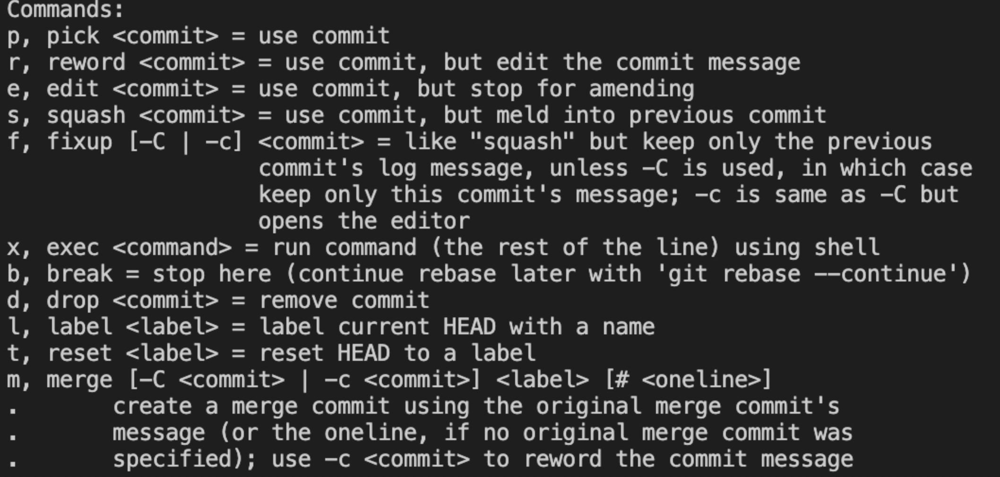

### git commit 规范指南

- feat: 新功能、新特性
- fix: 修改 bug
- perf: 更改代码，以提高性能（在不影响代码内部行为的前提下，**对程序性能进行优化**）
- refactor: 代码重构（**重构**，在不影响代码内部行为、功能下的代码修改）
- docs: 文档修改
- style: **代码格式**修改, 注意不是 css 修改（例如分号修改）
- test: 测试用例新增、修改
- build: 影响项目构建或依赖项修改
- revert: 恢复上一次提交
- ci: 持续集成相关文件修改
- chore: 其他修改（不在上述类型中的修改）
- release: 发布新版本

### .gitignore 规则不生效

.gitignore 只能忽略那些原来没有被 track 的文件，如果某些文件已经被纳入了版本管理中，则修改 .gitignore 是无效的。

解决方法就是先把本地缓存删除（改变成未 track 状态），然后再提交:

```zsh
$ git rm -r --cached .
$ git add .
$ git commit -m 'update .gitignore'
```

**你想添加一个文件到 Git，但发现添加不了，原因是这个文件被 .gitignore 忽略了：**

```zsh
$ git add App.class
The following paths are ignored by one of your .gitignore files:
App.class
Use -f if you really want to add them.
```

如果你确实想添加该文件，可以用 -f 强制添加到 Git ：

```zsh
$ git add -f App.class
```

或者你发现，可能是 .gitignore 写得有问题，需要找出来到底哪个规则写错了，可以用 git check-ignore 命令检查：

```zsh
$ git check-ignore -v App.class
.gitignore:3:*.class    App.class
```

Git 会告诉我们，.gitignore 的第3行规则忽略了该文件，于是我们就可以知道应该修订哪个规则。

### git rebase 使用指南

正确使用 git 工作流程：

- git clone master branch。

-  在自己本地环境 git checkout -b devBranch 创建开发分支。

- 在开发分支 devBranch 上开发和测试，期间可以 git add / git commit，可以不推送远程仓库。

- 需求验收通过后，可以提交代码到 master 分支，此处有两种推荐流程：

  1. 推送到 origin/devBranch，提 merge request，code review 之后合并到 master。
  2. 本地 git merge devBranch，再 git push master。

- 如果开发分支有多次提交，可以在 merge 到 master 之前合并成一次：

  1. 通过 git rebase -i 将本地的多次提交合并为一个，以简化提交历史。**本地有多个提交时，如果不进行这一步，在 git rebase master 时会多次解决冲突（最坏情况下，每一个提交都会相应解决一个冲突）**。

     ```zsh
     $ git rebase -i HEAD~4 // 表示合并最近的四次提交
     
     $ git rebase -i e65b97e332c0683631c334b870e0ceb062163815 // 或者是需要合并的提交之前，最近的一次 commit id
     ```

  2. 进入 vim 编辑器之后，单击 i 按键进入编辑模式，这时最下方会出现 -- INSERT -- 标识表示我们进入了编辑模式。

  3. Commands 可以看到我们可以使用的命令以及缩写以及每个命令的缩写。

     

  4. 编辑完毕之后，点击 esc 然后按住 shift+";“ ，最底下出现冒号，然后输入 wq 回车保存。

  5. 这时候就能看到我们之前提交的4个 commit 的信息，你可以选择在不要的 message 前面加个#号表示忽略掉这条信息，一般来说去掉几个不要的，只保留一个进行编辑或者保持原始状态。比如我在 log1 3 4 前面加个#号表示忽略，对log2进行编辑 。（这里依然要点击 i 进入编辑模式）

  6. 编辑完之后的效果如下，我想要提交的合并信息就是“meger log1-4”，重复上面的步骤保存退出。esc=>:wq

  7. 如果成功会有一行提示：Successfully rebased and updated refs/heads/feature/git-test.

     如果失败可以使用 git rebase --continue 进入 vim 编辑器重新操作。

     如果想要放弃这次编辑可以使用 git rebase --abort 命令中止本次操作。

  8. 最后使用命令 git push -f 强制推送。

- 切换到 master 分支，git pull 拉取最新的分支状态。

- 然后切回 devBranch 分支。

- git rebase master 将 master 最新的提交同步到 devBranch，这个过程可能需要手动解决冲突**（如果进行了上一步的话,只用解决一次冲突）**。

- 然后切换到 master 分支，git merge 将本地的 devBranch 分支内容合并到 master 分支。

- git push 将 master 分支的提交上传。

